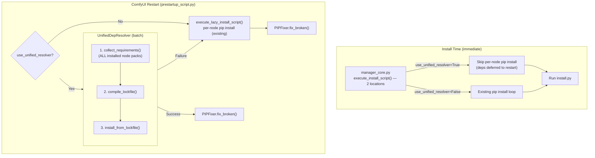
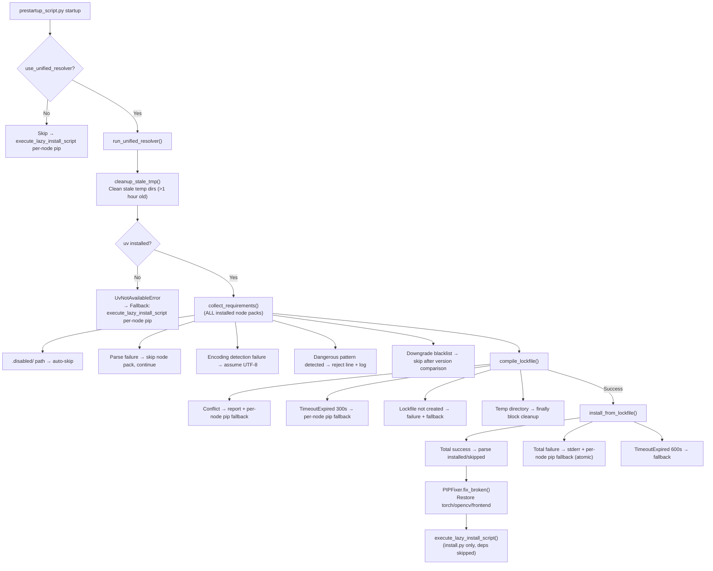
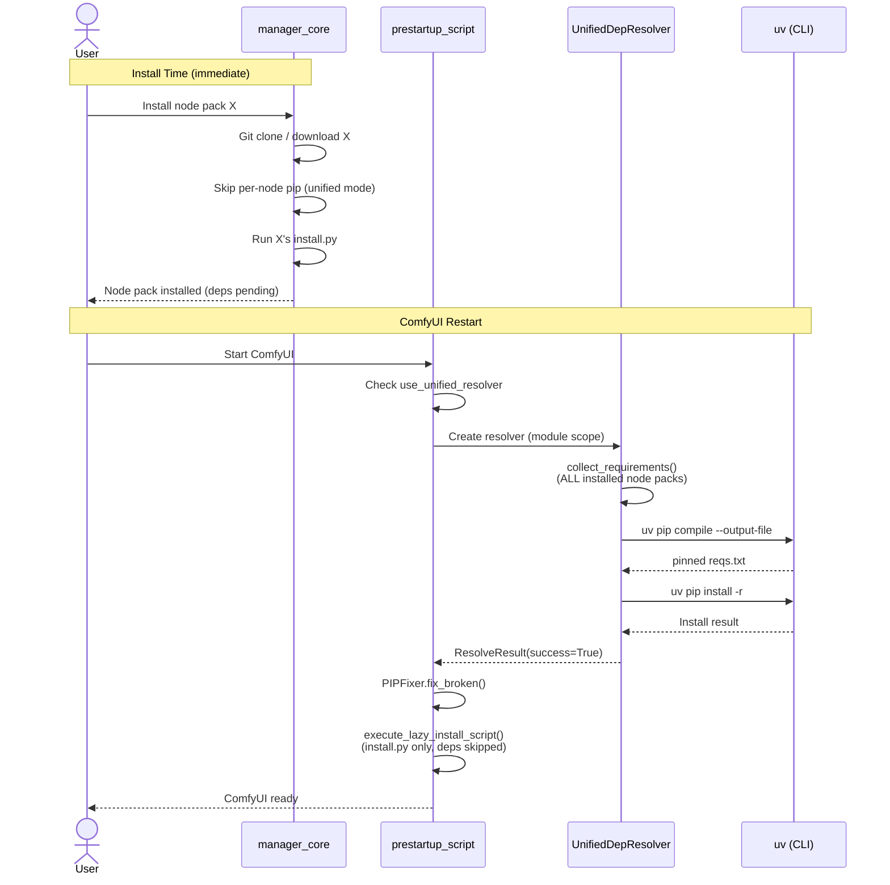

# Architecture Design: Unified Dependency Resolver

## 1. System Architecture

### 1.1 Module Location

```
comfyui_manager/
├── glob/
│   └── manager_core.py              # Existing: execute_install_script() call sites (2 locations)
├── common/
│   ├── manager_util.py              # Existing: get_pip_cmd(), PIPFixer, use_uv flag
│   ├── cm_global.py                 # Existing: pip_overrides, pip_blacklist (runtime dynamic assignment)
│   └── unified_dep_resolver.py      # New: Unified dependency resolution module
├── prestartup_script.py             # Existing: config reading, remap_pip_package, cm_global initialization
└── legacy/
    └── manager_core.py              # Legacy (not a modification target)
```

The new module `unified_dep_resolver.py` is added to the `comfyui_manager/common/` directory.
It reuses `manager_util` utilities and `cm_global` global state from the same package.

> **Warning**: `cm_global.pip_overrides`, `pip_blacklist`, `pip_downgrade_blacklist` are
> NOT defined in `cm_global.py`. They are **dynamically assigned** during `prestartup_script.py` execution.
> In v1 unified mode, these are **not applied** — empty values are passed to the resolver constructor.
> The constructor interface accepts them for future extensibility (defaults to empty when `None`).
>
> **[DEFERRED]** Reading actual `cm_global` values at startup is deferred to a future version.
> The startup batch resolver in `prestartup_script.py` currently passes `blacklist=set()`,
> `overrides={}`, `downgrade_blacklist=[]`. The constructor and internal methods
> (`_remap_package`, `_is_downgrade_blacklisted`, blacklist check) are fully implemented
> and will work once real values are provided.

### 1.2 Overall Flow



> **Key design change**: The unified resolver runs at **startup time** (module scope), not at install time.
> At install time, `execute_install_script()` skips the pip loop when unified mode is active.
> At startup, `prestartup_script.py` runs the resolver at module scope — unconditionally when enabled,
> independent of `install-scripts.txt` existence. Blacklist/overrides/downgrade_blacklist are bypassed
> (empty values passed); `uv pip compile` handles all conflict resolution natively.
>
> **Note**: `execute_install_script()` exists in 2 locations in the codebase (excluding legacy module).
> - `UnifiedManager.execute_install_script()` (class method): Used for CNR installs, etc.
> - Standalone function `execute_install_script()`: Used for updates, git installs, etc.
> Both skip per-node pip install when unified mode is active.

### 1.3 uv Command Strategy

**`uv pip compile`** → Generates pinned requirements.txt (pip-compatible)
- Do not confuse with `uv lock`
- `uv lock` generates `uv.lock` (TOML) — cross-platform but incompatible with pip workflows
- This design uses a pip-compatible workflow (`uv pip compile` → `uv pip install -r`)

**`uv pip install -r`** ← Used instead of `uv pip sync`
- `uv pip sync`: **Deletes** packages not in lockfile → Risk of removing torch, ComfyUI deps
- `uv pip install -r`: Only performs additive installs, preserves existing packages → Safe

---

## 2. Class Design

### 2.1 UnifiedDepResolver

```python
class UnifiedDepResolver:
    """
    Unified dependency resolver.

    Resolves and installs all dependencies of (installed node packs + new node packs)
    at once using uv.

    Responsibility scope: Dependency resolution and installation only.
    install.py execution and PIPFixer calls are handled by the caller (manager_core).
    """

    def __init__(
        self,
        node_pack_paths: list[str],
        base_requirements: list[str] | None = None,
        blacklist: set[str] | None = None,
        overrides: dict[str, str] | None = None,
        downgrade_blacklist: list[str] | None = None,
    ):
        """
        Args:
            node_pack_paths: List of node pack directory paths
            base_requirements: Base dependencies (ComfyUI requirements, etc.)
            blacklist: Blacklisted package set (default: empty set; not applied in v1 unified mode)
            overrides: Package name remapping dict (default: empty dict; not applied in v1 unified mode)
            downgrade_blacklist: Downgrade-prohibited package list (default: empty list; not applied in v1 unified mode)
        """

    def resolve_and_install(self) -> ResolveResult:
        """Execute full pipeline: stale cleanup → collect → compile → install.
        Calls cleanup_stale_tmp() at start to clean up residual files from previous abnormal terminations."""

    def collect_requirements(self) -> CollectedDeps:
        """Collect dependencies from all node packs"""

    def compile_lockfile(self, deps: CollectedDeps) -> LockfileResult:
        """Generate pinned requirements via uv pip compile"""

    def install_from_lockfile(self, lockfile_path: str) -> InstallResult:
        """Install from pinned requirements (uv pip install -r)"""
```

### 2.2 Data Classes

```python
@dataclass
class PackageRequirement:
    """Individual package dependency"""
    name: str              # Package name (normalized)
    spec: str              # Original spec (e.g., "torch>=2.0")
    source: str            # Source node pack path

@dataclass
class CollectedDeps:
    """All collected dependencies"""
    requirements: list[PackageRequirement]  # Collected deps (duplicates allowed, uv resolves)
    skipped: list[tuple[str, str]]          # (package_name, skip_reason)
    sources: dict[str, list[str]]           # {package_name: [source_node_packs]}
    extra_index_urls: list[str]             # Additional index URLs separated from --index-url entries

@dataclass
class LockfileResult:
    """Compilation result"""
    success: bool
    lockfile_path: str | None     # pinned requirements.txt path
    conflicts: list[str]          # Conflict details
    stderr: str                   # uv error output

@dataclass
class InstallResult:
    """Installation result (uv pip install -r is atomic: all-or-nothing)"""
    success: bool
    installed: list[str]     # Installed packages (stdout parsing)
    skipped: list[str]       # Already installed (stdout parsing)
    stderr: str              # uv stderr output (for failure analysis)

@dataclass
class ResolveResult:
    """Full pipeline result"""
    success: bool
    collected: CollectedDeps | None
    lockfile: LockfileResult | None
    install: InstallResult | None
    error: str | None
```

---

## 3. Core Logic Details

### 3.1 Dependency Collection (`collect_requirements`)

```python
# Input sanitization: dangerous patterns to reject
_DANGEROUS_PATTERNS = re.compile(
    r'^(-r\b|--requirement\b|-e\b|--editable\b|-c\b|--constraint\b'
    r'|--find-links\b|-f\b|.*@\s*file://)',
    re.IGNORECASE
)

def collect_requirements(self) -> CollectedDeps:
    requirements = []
    skipped = []
    sources = defaultdict(list)
    extra_index_urls = []

    for path in self.node_pack_paths:
        # Exclude disabled node packs (directory-based mechanism)
        # Disabled node packs are actually moved to custom_nodes/.disabled/,
        # so they should already be excluded from input at this point.
        # Defensive check: new style (.disabled/ directory) + old style ({name}.disabled suffix)
        if ('/.disabled/' in path
                or os.path.basename(os.path.dirname(path)) == '.disabled'
                or path.rstrip('/').endswith('.disabled')):
            continue

        req_file = os.path.join(path, "requirements.txt")
        if not os.path.exists(req_file):
            continue

        # chardet-based encoding detection (existing robust_readlines pattern)
        for line in self._read_requirements(req_file):
            line = line.split('#')[0].strip()
            if not line:
                continue

            # 0. Input sanitization (security)
            if self._DANGEROUS_PATTERNS.match(line):
                skipped.append((line, f"rejected: dangerous pattern in {path}"))
                logging.warning(f"[UnifiedDepResolver] rejected dangerous line: '{line}' from {path}")
                continue

            # 1. Separate --index-url / --extra-index-url handling
            #    (BEFORE path separator check, because URLs contain '/')
            if '--index-url' in line or '--extra-index-url' in line:
                pkg_spec, index_url = self._split_index_url(line)
                if index_url:
                    extra_index_urls.append(index_url)
                line = pkg_spec
                if not line:
                    # Standalone option line (no package prefix)
                    continue

            # 1b. Reject path separators in package name portion
            pkg_name_part = re.split(r'[><=!~;]', line)[0]
            if '/' in pkg_name_part or '\\' in pkg_name_part:
                skipped.append((line, f"rejected: path separator in package name"))
                continue

            # 2. Apply remap_pip_package (using cm_global.pip_overrides)
            pkg_spec = self._remap_package(line)

            # 3. Blacklist check (cm_global.pip_blacklist)
            pkg_name = self._extract_package_name(pkg_spec)
            if pkg_name in self.blacklist:
                skipped.append((pkg_spec, "blacklisted"))
                continue

            # 4. Downgrade blacklist check (includes version comparison)
            if self._is_downgrade_blacklisted(pkg_name, pkg_spec):
                skipped.append((pkg_spec, "downgrade blacklisted"))
                continue

            # 5. Collect (no dedup — uv handles resolution)
            req = PackageRequirement(
                name=pkg_name,
                spec=pkg_spec,
                source=path,
            )
            requirements.append(req)
            sources[pkg_name].append(path)

    return CollectedDeps(
        requirements=requirements,
        skipped=skipped,
        sources=dict(sources),
        extra_index_urls=list(set(extra_index_urls)),  # Deduplicate
    )

def _split_index_url(self, line: str) -> tuple[str, str | None]:
    """Split 'package_name --index-url URL' → (package_name, URL).

    Also handles standalone ``--index-url URL`` and
    ``--extra-index-url URL`` lines (with no package prefix).
    """
    # Handle --extra-index-url first (contains '-index-url' as substring
    # but NOT '--index-url' due to the extra-index prefix)
    for option in ('--extra-index-url', '--index-url'):
        if option in line:
            parts = line.split(option, 1)
            pkg_spec = parts[0].strip()
            url = parts[1].strip() if len(parts) == 2 else None
            return pkg_spec, url
    return line, None

def _is_downgrade_blacklisted(self, pkg_name: str, pkg_spec: str) -> bool:
    """Reproduce the downgrade version comparison from existing is_blacklisted() logic.

    Same logic as manager_core.py's is_blacklisted():
    - No version spec and already installed → block (prevent reinstall)
    - Operator is one of ['<=', '==', '<', '~='] and
      installed version >= requested version → block (prevent downgrade)
    - Version comparison uses manager_util.StrictVersion (NOT packaging.version)
    """
    if pkg_name not in self.downgrade_blacklist:
        return False

    installed_packages = manager_util.get_installed_packages()

    # Version spec parsing (same pattern as existing is_blacklisted())
    pattern = r'([^<>!~=]+)([<>!~=]=?)([^ ]*)'
    match = re.search(pattern, pkg_spec)

    if match is None:
        # No version spec: prevent reinstall if already installed
        if pkg_name in installed_packages:
            return True
    elif match.group(2) in ['<=', '==', '<', '~=']:
        # Downgrade operator: block if installed version >= requested version
        if pkg_name in installed_packages:
            try:
                installed_ver = manager_util.StrictVersion(installed_packages[pkg_name])
                requested_ver = manager_util.StrictVersion(match.group(3))
                if installed_ver >= requested_ver:
                    return True
            except (ValueError, TypeError):
                logging.warning(f"[UnifiedDepResolver] version parse failed: {pkg_spec}")
                return False

    return False

def _remap_package(self, pkg: str) -> str:
    """Package name remapping based on cm_global.pip_overrides.
    Reuses existing remap_pip_package() logic."""
    if pkg in self.overrides:
        remapped = self.overrides[pkg]
        logging.info(f"[UnifiedDepResolver] '{pkg}' remapped to '{remapped}'")
        return remapped
    return pkg
```

### 3.2 Lockfile Generation (`compile_lockfile`)

**Behavior:**
1. Create a unique temp directory (`tempfile.mkdtemp(prefix="comfyui_resolver_")`) for concurrency safety
2. Write collected requirements and base constraints to temp files
3. Execute `uv pip compile` with options:
   - `--output-file` (pinned requirements path within temp dir)
   - `--python` (current interpreter)
   - `--constraint` (base dependencies)
   - `--extra-index-url` (from `CollectedDeps.extra_index_urls`, logged via `_redact_url()`)
4. Timeout: 300s — returns `LockfileResult(success=False)` on `TimeoutExpired`
5. On `returncode != 0`: parse stderr for conflict details via `_parse_conflicts()`
6. Post-success verification: confirm lockfile was actually created (handles edge case of `returncode==0` without output)
7. Temp directory cleanup: `shutil.rmtree()` in `except` block; on success, caller (`resolve_and_install`'s `finally`) handles cleanup

### 3.3 Dependency Installation (`install_from_lockfile`)

**Behavior:**
1. Execute `uv pip install --requirement <lockfile_path> --python <sys.executable>`
   - **NOT `uv pip sync`** — sync deletes packages not in lockfile (dangerous for torch, ComfyUI deps)
2. `uv pip install -r` is **atomic** (all-or-nothing): no partial failure
3. Timeout: 600s — returns `InstallResult(success=False)` on `TimeoutExpired`
4. On success: parse stdout via `_parse_install_output()` to populate `installed`/`skipped` lists
5. On failure: `stderr` captures the failure cause; `installed=[]` (atomic model)

### 3.4 uv Command Resolution

**`_get_uv_cmd()` resolution order** (mirrors existing `get_pip_cmd()` pattern):
1. **Module uv**: `[sys.executable, '-m', 'uv']` (with `-s` flag for embedded Python — note: `python_embeded` spelling is intentional, matching ComfyUI Windows distribution path)
2. **Standalone uv**: `['uv']` via `shutil.which('uv')`
3. **Not found**: raises `UvNotAvailableError` → caught by caller for pip fallback

### 3.5 Stale Temp File Cleanup

**`cleanup_stale_tmp(max_age_seconds=3600)`** — classmethod, called at start of `resolve_and_install()`:
- Scans `tempfile.gettempdir()` for directories with prefix `comfyui_resolver_`
- Deletes directories older than `max_age_seconds` (default: 1 hour)
- Silently ignores `OSError` (permission issues, etc.)

### 3.6 Credential Redaction

```python
_CREDENTIAL_PATTERN = re.compile(r'://([^@]+)@')

def _redact_url(self, url: str) -> str:
    """Mask authentication info in URLs. user:pass@host → ****@host"""
    return self._CREDENTIAL_PATTERN.sub('://****@', url)
```

All `--extra-index-url` logging passes through `_redact_url()`:
```python
# Logging example within compile_lockfile()
for url in deps.extra_index_urls:
    logging.info(f"[UnifiedDepResolver] extra-index-url: {self._redact_url(url)}")
    cmd += ["--extra-index-url", url]  # Original URL passed to actual command
```

---

## 4. Existing Code Integration

### 4.1 manager_core.py Modification Points

**2 `execute_install_script()` locations — both skip deps in unified mode:**

#### 4.1.1 UnifiedManager.execute_install_script() (Class Method)

#### 4.1.2 Standalone Function execute_install_script()

**Both locations use the same pattern when unified mode is active:**

1. `lazy_mode=True` → schedule and return early (unchanged)
2. If `not no_deps and manager_util.use_unified_resolver`:
   - **Skip** the `requirements.txt` pip install loop entirely (deps deferred to startup)
   - Log: `"[UnifiedDepResolver] deps deferred to startup batch resolution"`
3. If `not manager_util.use_unified_resolver`: existing pip install loop runs (unchanged)
4. `install.py` execution: **always runs immediately** regardless of resolver mode

> **Parameter ordering differs:**
> - Method: `(self, url, repo_path, instant_execution, lazy_mode, no_deps)`
> - Standalone: `(url, repo_path, lazy_mode, instant_execution, no_deps)`

### 4.1.3 Startup Batch Resolver (`prestartup_script.py`)

**New**: Runs unified resolver at **module scope** — unconditionally when enabled, independent of `install-scripts.txt` existence.

**Execution point**: After config reading and `cm_global` initialization, **before** the `execute_startup_script()` gate.

**Logic** (uses module-level helpers from `unified_dep_resolver.py`):
1. `collect_node_pack_paths(folder_paths.get_folder_paths('custom_nodes'))` — enumerate all installed node pack directories
2. `collect_base_requirements(comfy_path)` — read `requirements.txt` + `manager_requirements.txt` from ComfyUI root (base deps only)
3. Create `UnifiedDepResolver` with **empty** blacklist/overrides/downgrade_blacklist (uv handles resolution natively; interface preserved for extensibility)
4. Call `resolve_and_install()` → on success set `_unified_resolver_succeeded = True`
5. On failure (including `UvNotAvailableError`): log warning, fall back to per-node pip

> `manager_requirements.txt` is read **only** from `comfy_path` (ComfyUI base), never from node packs.
> Node packs' `requirements.txt` are collected by the resolver's `collect_requirements()` method.

### 4.1.5 `execute_lazy_install_script()` Modification

When unified resolver **succeeds**, `execute_lazy_install_script()` skips the per-node pip install loop
(deps already batch-resolved at module scope). `install.py` still runs per node pack.

```python
# In execute_lazy_install_script():
if os.path.exists(requirements_path) and not _unified_resolver_succeeded:
    # Per-node pip install: only runs if unified resolver is disabled or failed
    ...
# install.py always runs regardless
```

> **Note**: Gated on `_unified_resolver_succeeded` (success flag), NOT `use_unified_resolver` (enable flag).
> If the resolver is enabled but fails, `_unified_resolver_succeeded` remains False → per-node pip runs as fallback.

### 4.2 Configuration Addition (config.ini)

```ini
[default]
# Existing settings...
use_unified_resolver = false   # Enable unified dependency resolution
```

### 4.3 Configuration Reading

Follows the existing `read_uv_mode()` / `use_uv` pattern:
- `prestartup_script.py`: `read_unified_resolver_mode()` reads from `default_conf` → sets `manager_util.use_unified_resolver`
- `manager_core.py`: `read_config()` / `write_config()` / `get_config()` include `use_unified_resolver` key
- `read_config()` exception fallback must include `use_unified_resolver` key to prevent `KeyError` in `write_config()`

### 4.4 manager_util.py Extension

```python
# manager_util.py
use_unified_resolver = False  # New global flag (separate from use_uv)
```

---

## 5. Error Handling Strategy



> **Fallback model**: On resolver failure at startup, `execute_lazy_install_script()` runs normally
> (per-node pip install), providing the same behavior as if unified mode were disabled.

---

## 6. File Structure

### 6.1 New Files

```
comfyui_manager/common/unified_dep_resolver.py   # Main module (~350 lines, includes sanitization/downgrade logic)
tests/test_unified_dep_resolver.py              # Unit tests
```

### 6.2 Modified Files

```
comfyui_manager/glob/manager_core.py       # Skip per-node pip in unified mode (2 execute_install_script locations)
comfyui_manager/common/manager_util.py     # Add use_unified_resolver flag
comfyui_manager/prestartup_script.py       # Config reading + startup batch resolver + execute_lazy_install_script modification
```

> **Not modified**: `comfyui_manager/legacy/manager_core.py` (legacy paths retain existing pip behavior)

---

## 7. Dependencies

| Dependency | Purpose | Notes |
|-----------|---------|-------|
| `uv` | Dependency resolution and installation | Already included in project dependencies |
| `cm_global` | pip_overrides, pip_blacklist, pip_downgrade_blacklist | Reuse existing global state (runtime dynamic assignment) |
| `manager_util` | StrictVersion, get_installed_packages, use_unified_resolver flag | Reuse existing utilities |
| `tempfile` | Temporary requirements files, mkdtemp | Standard library |
| `subprocess` | uv process execution | Standard library |
| `dataclasses` | Result data structures | Standard library |
| `re` | Input sanitization, version spec parsing, credential redaction | Standard library |
| `shutil` | uv lookup (`which`), temp directory cleanup | Standard library |
| `time` | Stale temp file age calculation | Standard library |
| `logging` | Per-step logging | Standard library |

No additional external dependencies.

---

## 8. Sequence Diagram

### Install Time + Startup Batch Resolution



---

## 9. Test Strategy

### 9.1 Unit Tests

| Test Target | Cases |
|------------|-------|
| `collect_requirements` | Normal parsing, empty file, blacklist filtering, comment handling, remap application |
| `.disabled` filtering | Exclude node packs within `.disabled/` directory path (directory-based mechanism) |
| Input sanitization | Reject lines with `-r`, `-e`, `--find-links`, `@ file://`, path separators |
| `--index-url` / `--extra-index-url` separation | `package --index-url URL`, standalone `--index-url URL`, standalone `--extra-index-url URL`, `package --extra-index-url URL` → package spec + extra_index_urls separation |
| Downgrade blacklist | Installed + lower version request → skip, not installed → pass, same/higher version → pass |
| `compile_lockfile` | Normal compilation, conflict detection, TimeoutExpired, constraint application, --output-file verification |
| Lockfile existence verification | Failure handling when file not created despite returncode==0 |
| `extra_index_urls` passthrough | Verify `--extra-index-url` argument included in compile command |
| `install_from_lockfile` | Normal install, total failure, TimeoutExpired |
| Atomic model | On failure: installed=[], stderr populated |
| `_get_uv_cmd` | Module uv, standalone uv, embedded python (`python_embeded`), not installed |
| `_remap_package` | pip_overrides remapping, unregistered packages |
| Blacklist | torch family, torchsde, custom blacklist |
| Duplicate handling | Same package with multiple specs → all passed to uv |
| Multiple paths | Collection from multiple custom_nodes paths |
| `cm_global` defense | Default values used when `pip_blacklist` etc. not assigned |
| Concurrency | Two resolver instances each use unique temp directories |
| Credential redaction | `user:pass@host` URL masked in log output |
| `_redact_url` | `://user:pass@host` → `://****@host` conversion, no-credential URL passthrough |
| `cleanup_stale_tmp` | Delete stale dirs >1 hour, preserve recent dirs, ignore permission errors |
| Downgrade operators | `<=`, `==`, `<`, `~=` blocked; `>=`, `>`, `!=` pass; no spec + installed → blocked |
| `StrictVersion` comparison | Verify `manager_util.StrictVersion` is used (not `packaging.version`) |

### 9.2 Integration Tests

- End-to-end test in real uv environment
- Existing pip fallback path test
- config.ini setting toggle test
- Environment integrity verification after PIPFixer call
- lazy_mode scheduling behavior verification (Windows simulation)
- `use_uv=False` + `use_unified_resolver=True` combination test
- Large-scale dependency (50+ node packs) performance test

---

## 10. Implementation Order

1. **Phase 1**: Data classes and `collect_requirements` implementation + tests
   - PackageRequirement, CollectedDeps (including extra_index_urls) and other data classes
   - Blacklist/override filtering
   - **Downgrade blacklist** (version comparison logic included)
   - **Input sanitization** (-r, -e, @ file:// etc. rejection)
   - **`--index-url` / `--extra-index-url` separation handling** (package spec + extra_index_urls)
   - **`.disabled` node pack filtering**
   - Defensive cm_global access (getattr pattern)
2. **Phase 2**: `compile_lockfile` implementation + tests
   - uv pip compile invocation
   - --output-file, --constraint, --python options
   - Conflict parsing logic
3. **Phase 3**: `install_from_lockfile` implementation + tests
   - uv pip install -r invocation (NOT sync)
   - Install result parsing
4. **Phase 4**: Integration — startup batch + install-time skip
   - `prestartup_script.py`: Module-scope startup batch resolver + `execute_lazy_install_script()` deps skip
   - `manager_core.py`: Skip per-node pip in 2 `execute_install_script()` locations
   - `manager_util.py`: `use_unified_resolver` flag
   - Config reading (`read_unified_resolver_mode()`, `read_config()`/`write_config()`)
5. **Phase 5**: Integration tests + fallback verification + startup batch tests

---

## Appendix A: Existing Code Reference

> **Note**: Line numbers may shift as code changes, so references use symbol names (function/class names).
> Use `grep -n` or IDE symbol search for exact locations.

### remap_pip_package Location (Code Duplication Exists)

```
comfyui_manager/glob/manager_core.py     — def remap_pip_package(pkg)
comfyui_manager/prestartup_script.py     — def remap_pip_package(pkg)
```

Both reference `cm_global.pip_overrides` with identical logic.
The unified resolver uses `cm_global.pip_overrides` directly to avoid adding more duplication.

### cm_global Global State

```python
# Dynamically assigned in prestartup_script.py (NOT defined in cm_global.py!)
cm_global.pip_blacklist = {'torch', 'torchaudio', 'torchsde', 'torchvision'}  # set
cm_global.pip_overrides = {}                                                   # dict, loaded from JSON
cm_global.pip_downgrade_blacklist = [                                          # list
    'torch', 'torchaudio', 'torchsde', 'torchvision',
    'transformers', 'safetensors', 'kornia'
]
```

> **cm_cli path**: `cm_cli/__main__.py` also independently initializes these attributes.
> If the resolver may be called from the CLI path, this initialization should also be verified.

### PIPFixer Call Pattern

```python
# Within UnifiedManager.execute_install_script() method in manager_core.py:
pip_fixer = manager_util.PIPFixer(
    manager_util.get_installed_packages(),
    context.comfy_path,
    context.manager_files_path
)
# ... (after installation)
pip_fixer.fix_broken()
```

The unified resolver does not call PIPFixer directly.
The caller (execute_install_script) calls PIPFixer as part of the existing flow.

### is_blacklisted() Logic (Must Be Reproduced in Unified Resolver)

```python
# manager_core.py — def is_blacklisted(name)
# 1. Simple pip_blacklist membership check
# 2. pip_downgrade_blacklist version comparison:
#    - Parse spec with regex r'([^<>!~=]+)([<>!~=]=?)([^ ]*)'
#    - match is None (no version spec) + installed → block
#    - Operator in ['<=', '==', '<', '~='] + installed version >= requested version → block
#    - Version comparison uses manager_util.StrictVersion (NOT packaging.version)
```

The unified resolver's `_is_downgrade_blacklisted()` method faithfully reproduces this logic.
It uses `manager_util.StrictVersion` instead of `packaging.version.parse()` to ensure consistency with existing behavior.

### Existing Code --index-url Handling (Asymmetric)

```python
# Only exists in standalone function execute_install_script():
if '--index-url' in package_name:
    s = package_name.split('--index-url')
    install_cmd = manager_util.make_pip_cmd(["install", s[0].strip(), '--index-url', s[1].strip()])

# UnifiedManager.execute_install_script() method does NOT have this handling
```

The unified resolver unifies both paths for consistent handling via `_split_index_url()`.
