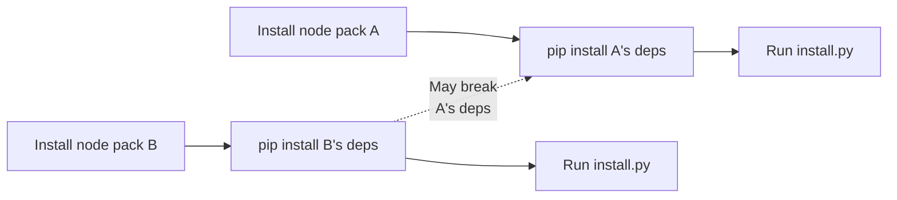

# PRD: Unified Dependency Resolver

## 1. Overview

### 1.1 Background
ComfyUI Manager currently installs each node pack's `requirements.txt` individually via `pip install`.
This approach causes dependency conflicts where installing a new node pack can break previously installed node packs' dependencies.

**Current flow:**


### 1.2 Goal
Implement a unified dependency installation module that uses `uv` to resolve all dependencies (installed node packs + new node packs) at once.

**New flow (unified resolver mode):**

```mermaid
graph TD
    subgraph "Install Time (immediate)"
        A1[User installs node pack X] --> A2[Git clone / download]
        A2 --> A3["Run X's install.py (if exists)"]
        A3 --> A4["Skip per-node pip install<br/>(deps deferred to restart)"]
    end

    subgraph "ComfyUI Restart (startup batch)"
        B1[prestartup_script.py] --> B2[Collect ALL installed node packs' deps]
        B2 --> B3["uv pip compile → pinned requirements.txt"]
        B3 --> B4["uv pip install -r → Batch install"]
        B4 --> B5[PIPFixer environment correction]
    end
```


> **Terminology**: In this document, "lockfile" refers to the **pinned requirements.txt** generated by `uv pip compile`.
> This is different from the `uv.lock` (TOML format) generated by `uv lock`. We use a pip-compatible workflow.

### 1.3 Scope
- Develop a new dedicated dependency resolution module
- Opt-in activation from the existing install process
- **Handles dependency resolution (deps install) only**. `install.py` execution is handled by existing logic

---

## 2. Constraints

| Item | Description |
|------|-------------|
| **uv required** | Only operates in environments where `uv` is available |
| **Independent of `use_uv` flag** | `use_unified_resolver` is separate from the existing `use_uv` flag. Even if `use_uv=False`, setting `use_unified_resolver=True` attempts resolver activation. Auto-fallback if uv is not installed |
| **Pre-validated list** | Input node pack list is assumed to be pre-verified for mutual dependency compatibility |
| **Backward compatibility** | Existing pip-based install process is fully preserved (fallback) |
| **Blacklist/overrides bypassed** | In unified mode, `pip_blacklist`, `pip_overrides`, `pip_downgrade_blacklist` are NOT applied (empty values passed). Constructor interface is preserved for future extensibility. `uv pip compile` handles all conflict resolution natively. **[DEFERRED]** Reading actual values from `cm_global` at startup is deferred to a future version — v1 always passes empty values |
| **Multiple custom_nodes paths** | Supports all paths returned by `folder_paths.get_folder_paths('custom_nodes')` |
| **Scope of application** | Batch resolver runs at **module scope** in `prestartup_script.py` (unconditionally when enabled, independent of `install-scripts.txt` existence). The 2 `execute_install_script()` locations skip per-node pip install when unified mode is active (deps deferred to restart). `execute_lazy_install_script()` is also modified to skip per-node pip install in unified mode. Other install paths such as `install_manager_requirements()`, `pip_install()` are outside v1 scope (future extension) |
| **Legacy module** | `comfyui_manager/legacy/manager_core.py` is excluded from modification. Legacy paths retain existing pip behavior |

---

## 3. Functional Requirements

### FR-1: Node Pack List and Base Dependency Input

**Input:**
- Node pack list (fullpath list of installed + to-be-installed node packs)
- Base dependencies (ComfyUI's `requirements.txt` and `manager_requirements.txt`)

**Behavior:**
- Validate each node pack path
- Exclude disabled (`.disabled`) node packs
  - Detection criteria: Existence of `custom_nodes/.disabled/{node_pack_name}` **directory**
  - Existing mechanism: Disabling a node pack **moves** it from `custom_nodes/` to `custom_nodes/.disabled/` (does NOT create a `.disabled` file inside the node pack)
  - At resolver input time, disabled node packs should already be absent from `custom_nodes/`, so normally they won't be in `node_pack_paths`
  - Defensively exclude any node pack paths that are within the `.disabled` directory
- Base dependencies are treated as constraints
- Traverse all paths from `folder_paths.get_folder_paths('custom_nodes')`

**`cm_global` runtime dependencies:**
- `cm_global.pip_overrides`, `pip_blacklist`, `pip_downgrade_blacklist` are dynamically assigned during `prestartup_script.py` execution
- In unified mode, these are **not applied** — empty values are passed to the resolver constructor
- The constructor interface accepts these parameters for future extensibility (defaults to empty when `None`)

### FR-2: Dependency List Extraction

**Behavior:**
- Parse `requirements.txt` from each node pack directory
  - Encoding: Use `robust_readlines()` pattern (`chardet` detection, assumes UTF-8 if not installed)
- Package name remapping (constructor accepts `overrides` dict — **empty in v1**, interface preserved for extensibility)
- Blacklist package filtering (constructor accepts `blacklist` set — **empty in v1**, uv handles torch etc. natively)
- Downgrade blacklist filtering (constructor accepts `downgrade_blacklist` list — **empty in v1**)
- **Note**: In unified mode, `uv pip compile` resolves all version conflicts natively. The blacklist/overrides/downgrade_blacklist mechanisms from the existing pip flow are bypassed
- Strip comments (`#`) and blank lines
- **Input sanitization** (see below)
- Separate handling of `--index-url` entries (see below)

**Input sanitization:**
- Requirements lines matching the following patterns are **rejected and logged** (security defense):
  - `-r`, `--requirement` (recursive include → path traversal risk)
  - `-e`, `--editable` (VCS/local path install → arbitrary code execution risk)
  - `-c`, `--constraint` (external constraint file injection)
  - `--find-links`, `-f` (external package source specification)
  - `@ file://` (local file reference → path traversal risk)
  - Package names containing path separators (`/`, `\`)
- Allowed items: Package specs (`name>=version`), specs with `--index-url`, environment markers (containing `;`)
- Rejected lines are recorded in the `skipped` list with reason

**`--index-url` handling:**
- Existing code (standalone function `execute_install_script()`) parses `package_name --index-url URL` format for special handling
- **Note**: The class method `UnifiedManager.execute_install_script()` does NOT have this handling (asymmetric)
- The unified resolver **unifies both paths** for consistent handling:
  - Package spec → added to the general dependency list
  - `--extra-index-url URL` → passed as `uv pip compile` argument
- Separated index URLs are collected in `CollectedDeps.extra_index_urls`
- **Credential redaction**: Authentication info (`user:pass@`) in index URLs is masked during logging

**Duplicate handling strategy:**
- No deduplication is performed directly
- Different version specs of the same package are **all passed as-is** to uv
- `uv pip compile` handles version resolution (uv determines the optimal version)

**Output:**
- Unified dependency list (tracked by source node pack)
- Additional index URL list

### FR-3: uv pip compile Execution

**Behavior:**
- Generate temporary requirements file from the collected dependency list
- Execute `uv pip compile` to produce a pinned requirements.txt
  - `--output-file` (required): Specify output file (outputs to stdout only if not specified)
  - `--constraint`: Pass base dependencies as constraints
  - `--python`: Current Python interpreter path
  - `--extra-index-url`: Additional index URLs collected from FR-2 (multiple allowed)
- Resolve for the current platform (platform-specific results)

**Error handling:**
- Return conflict package report when resolution fails
- Timeout handling (300s): Explicitly catch `subprocess.TimeoutExpired`, terminate child process, then fallback
- Lockfile output file existence verification: Confirm file was actually created even when `returncode == 0`
- Temp file cleanup: Guaranteed in `finally` block. Includes stale temp file cleanup logic at next execution for abnormal termination (SIGKILL) scenarios

**Output:**
- pinned requirements.txt (file with all packages pinned to exact versions)

### FR-4: Pinned Requirements-based Dependency Installation

**Behavior:**
- Execute `uv pip install -r <pinned-requirements.txt>`
  - **Do NOT use `uv pip sync`**: sync deletes packages not in the lockfile, risking removal of torch, ComfyUI's own dependencies, etc.
- Already-installed packages at the same version are skipped (default uv behavior)
- Log installation results

**Error handling:**
- `uv pip install -r` is an **atomic operation** (all-or-nothing)
- On total failure: Parse stderr for failure cause report → fallback to existing pip
- **No partial failure report** (not possible due to uv's behavior)
- `InstallResult`'s `installed`/`skipped` fields are populated by parsing uv stdout; `stderr` records failure cause (no separate `failed` field needed due to atomic model)

### FR-5: Post-install Environment Correction

**Behavior:**
- Call `PIPFixer.fix_broken()` for environment integrity correction
  - Restore torch version (when change detected)
  - Fix OpenCV conflicts
  - Restore comfyui-frontend-package
  - Restore packages based on `pip_auto_fix.list`
- **This step is already performed in the existing `execute_install_script()` flow, so the unified resolver itself doesn't need to call it**
  - However, an optional call option is provided for cases where the resolver is invoked independently outside the existing flow

### FR-6: install.py Execution (Existing Flow Maintained)

**Behavior:**
- The unified resolver handles deps installation **at startup time only**
- `install.py` execution is handled by the existing `execute_install_script()` flow and runs **immediately** at install time
- Deps are deferred to startup batch resolution; `install.py` runs without waiting for deps

**Control flow specification (unified mode active):**
- `execute_install_script()`: **skip** the `requirements.txt`-based individual pip install loop entirely (deps will be resolved at next restart)
- `install.py` execution runs **immediately** as before
- At next ComfyUI restart: `prestartup_script.py` runs the unified resolver for all installed node packs

**Control flow specification (unified mode inactive / fallback):**
- Existing pip install loop runs as-is (no change)
- `install.py` execution runs **immediately** as before

### FR-7: Startup Batch Resolution

**Behavior:**
- When `use_unified_resolver=True`, **all dependency resolution is deferred to ComfyUI startup**
- At install time: node pack itself is installed (git clone, etc.) and `install.py` runs immediately, but `requirements.txt` deps are **not** installed per-request
- At startup time: `prestartup_script.py` runs the unified resolver once for all installed node packs

**Startup execution flow (in `prestartup_script.py`):**
1. At **module scope** (before `execute_startup_script()` gate): check `manager_util.use_unified_resolver` flag
2. If enabled: collect all installed node pack paths, read base requirements from `comfy_path`
3. Create `UnifiedDepResolver` with empty blacklist/overrides/downgrade_blacklist (uv handles resolution natively)
4. Call `resolve_and_install()` — collects all deps → compile → install in one batch
5. On success: set `_unified_resolver_succeeded = True`, skip per-node pip in `execute_lazy_install_script()`
6. On failure: log warning, `execute_lazy_install_script()` falls back to existing per-node pip install
7. **Note**: Runs unconditionally when enabled, independent of `install-scripts.txt` existence

**`execute_install_script()` behavior in unified mode:**
- Skip the `requirements.txt` pip install loop entirely (deps will be handled at restart)
- `install.py` execution still runs immediately

**`execute_lazy_install_script()` behavior in unified mode:**
- Skip the `requirements.txt` pip install loop (already handled by startup batch resolver)
- `install.py` execution still runs

**Windows-specific behavior:**
- Windows lazy install path also benefits from startup batch resolution
- `try_install_script()` defers to `reserve_script()` as before for non-`instant_execution=True` installs

---

## 4. Non-functional Requirements

| Item | Requirement |
|------|-------------|
| **Performance** | Equal to or faster than existing individual installs |
| **Stability** | Must not break the existing environment |
| **Logging** | Log progress and results at each step (details below) |
| **Error recovery** | Fallback to existing pip method on failure |
| **Testing** | Unit test coverage above 80% |
| **Security** | requirements.txt input sanitization (see FR-2), credential log redaction, subprocess list-form invocation |
| **Concurrency** | Prevent lockfile path collisions on concurrent install requests. Use process/thread-unique suffixes or temp directories |
| **Temp files** | Guarantee temp file cleanup on both normal and abnormal termination. Clean stale files on next execution |

### Logging Requirements

| Step | Log Level | Content |
|------|-----------|---------|
| Resolver start | `INFO` | Node pack count, total dependency count, mode (unified/pip) |
| Dependency collection | `INFO` | Collection summary (collected N, skipped N, sources N) |
| Dependency collection | `DEBUG` | Per-package collection/skip/remap details |
| `--index-url` detection | `INFO` | Detected additional index URL list |
| uv compile start | `INFO` | Execution command (excluding sensitive info) |
| uv compile success | `INFO` | Pinned package count, elapsed time |
| uv compile failure | `WARNING` | Conflict details, fallback transition notice |
| Install start | `INFO` | Number of packages to install |
| Install success | `INFO` | Installed/skipped/failed count summary, elapsed time |
| Install failure | `WARNING` | Failed package list, fallback transition notice |
| Fallback transition | `WARNING` | Transition reason, original error message |
| Overall completion | `INFO` | Final result summary (success/fallback/failure) |

> **Log prefix**: All logs use `[UnifiedDepResolver]` prefix to distinguish from existing pip install logs

---

## 5. Usage Scenarios

### Scenario 1: Single Node Pack Installation (unified mode)
```
User requests installation of node pack X
→ Git clone / download node pack X
→ Run X's install.py (if exists) — immediately
→ Skip per-node pip install (deps deferred)
→ User restarts ComfyUI
→ prestartup_script.py: Collect deps from ALL installed node packs (A,B,C,X)
→ uv pip compile resolves fully compatible versions
→ uv pip install -r for batch installation
→ PIPFixer environment correction
```

### Scenario 2: Multi Node Pack Batch Installation (unified mode)
```
User requests installation of node packs X, Y, Z
→ Each node pack: git clone + install.py — immediately
→ Per-node pip install skipped for all
→ User restarts ComfyUI
→ prestartup_script.py: Collect deps from ALL installed node packs (including X,Y,Z)
→ Single uv pip compile → single uv pip install -r
→ PIPFixer environment correction
```

### Scenario 3: Dependency Resolution Failure (Edge Case)
```
Even pre-validated lists may fail due to uv version differences or platform issues
→ uv pip compile failure → return conflict report
→ Display conflict details to user
→ Auto-execute existing pip fallback
```

### Scenario 4: uv Not Installed
```
uv unavailable detected → auto-fallback to existing pip method
→ Display uv installation recommendation to user
```

### Scenario 5: Windows Lazy Installation (unified mode)
```
Node pack installation requested on Windows
→ Node pack install deferred to startup (existing lazy mechanism)
→ On next ComfyUI startup: unified resolver runs first (batch deps)
→ execute_lazy_install_script() skips per-node pip (already resolved)
→ install.py still runs per node pack
```

### Scenario 6: Malicious/Non-standard requirements.txt
```
Node pack's requirements.txt contains `-r ../../../etc/hosts` or `-e git+https://...`
→ Sanitization filter rejects the line
→ Log rejection reason and continue processing remaining valid packages
→ Notify user of rejected item count
```

### Scenario 7: Concurrent Install Requests (unified mode)
```
User requests installation of node packs A and B nearly simultaneously from UI
→ Each request: git clone + install.py immediately, deps skipped
→ On restart: single unified resolver run handles both A and B deps together
→ No concurrency issue (single batch at startup)
```

---

## 6. Success Metrics

| Metric | Target |
|--------|--------|
| Dependency conflict reduction | 90%+ reduction compared to current |
| Install success rate | 99%+ (for compatibility-verified lists) |
| Performance | Equal to or better than existing individual installs |
| Adoption rate | 50%+ of eligible users |

---

## 7. Future Extensions

- **`cm_global` integration** [DEFERRED]: Read `pip_blacklist`, `pip_overrides`, `pip_downgrade_blacklist` from `cm_global` runtime values instead of passing empty. Constructor interface already accepts these parameters
- Lockfile caching: Reuse for identical node pack configurations
- Pre-install dependency conflict validation API: Check compatibility before installation
- Dependency tree visualization: Display dependency relationships to users
- `uv lock`-based cross-platform lockfile support (TOML format)
- `install_manager_requirements()` integration: Resolve manager's own dependencies through unified resolver
- `pip_install()` integration: Route UI direct installs through unified resolver
- Legacy module (`comfyui_manager/legacy/`) unified resolver support

---

## Appendix A: Existing Code Install Path Mapping

> This section is reference material to clarify the unified resolver's scope of application.

| Install Path | Location | v1 Applied | Notes |
|-------------|----------|------------|-------|
| `UnifiedManager.execute_install_script()` | `glob/manager_core.py` (method) | ✅ Yes | Skips per-node pip in unified mode (deps deferred to restart) |
| Standalone `execute_install_script()` | `glob/manager_core.py` (function) | ✅ Yes | Skips per-node pip in unified mode (deps deferred to restart) |
| `execute_lazy_install_script()` | `prestartup_script.py` | ✅ Yes | Skips per-node pip in unified mode (already batch-resolved) |
| Startup batch resolver | `prestartup_script.py` | ✅ Yes | **New**: Runs unified resolver once at startup for all node packs |
| `install_manager_requirements()` | `glob/manager_core.py` | ❌ No | Manager's own deps |
| `pip_install()` | `glob/manager_core.py` | ❌ No | UI direct install |
| Legacy `execute_install_script()` (2 locations) | `legacy/manager_core.py` | ❌ No | Legacy paths |
